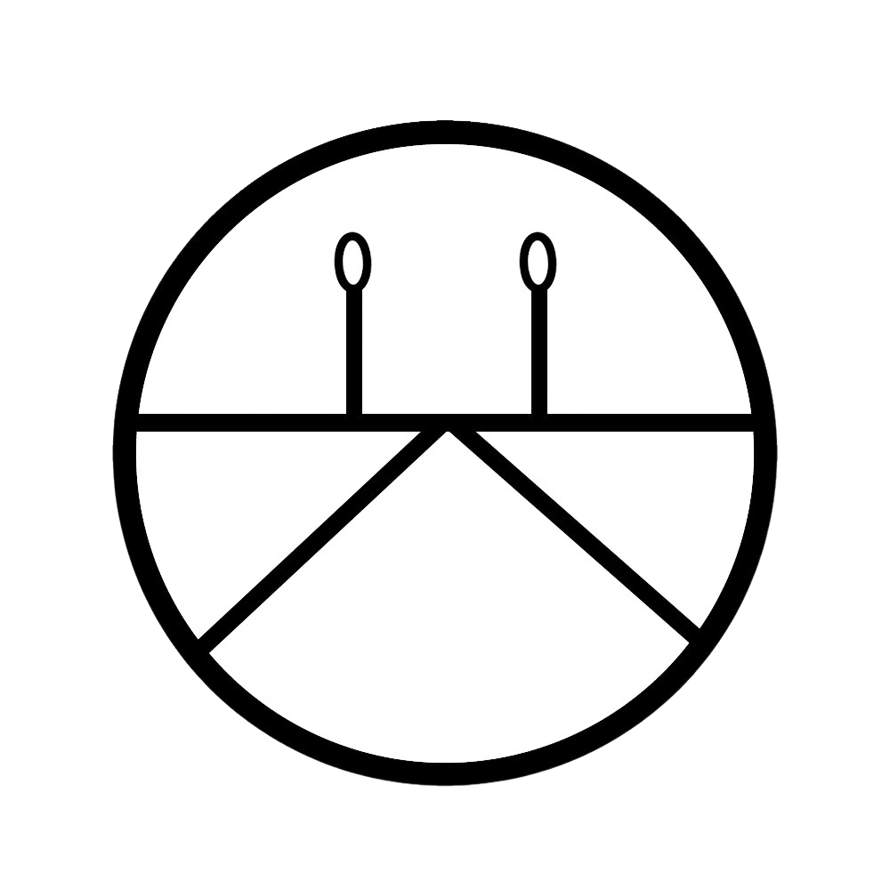

<table align="right">
 <tr><td><a href="README.md">英語</a></td></tr>
 <tr><td><a href="README_sp.md">スペイン語</a></td></tr>
 <tr><td><a href="README_jp.md">日本語</a></td></tr>
</table>

 <ul align="center" style="list-style: none;">
    

      <h1 align="center">Hi there, I'm 
       <a href="https://www.kangris.dev/" target="_blank" style="color: #ce33ff ">Alejandro Gutiérrez</a>
       
      </h1>
    

 </ul>

I'm a programming and technology aficionado with a strong passion for all things open source. I love learning.

&nbsp;
&nbsp;
&nbsp;
&nbsp;

 

 

## &nbsp;About me

- ⭐ Github Star ⭐ 
- 📲 Mobile developer

 

## &nbsp;Skills:
### Languages 📙

 &nbsp;
 &nbsp;
 &nbsp;
 &nbsp;
 &nbsp;
 &nbsp;

### Tools 🛠️

 &nbsp;
 &nbsp;
 &nbsp;
 &nbsp;

### IDE's 

 &nbsp;
 &nbsp;
 &nbsp;

### Database 💾

 &nbsp;
 &nbsp;

## &nbsp;GitHub Analytics 🚀

 <a href="https://github.com/Kangr1s">
   &nbsp;
   &nbsp; 
 </a>

 

 &nbsp;

## &nbsp;Connect with me ✉️

      
    

  

 

    
    

